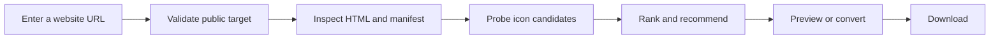

<div align="center">
  <a href="https://icon-scout.netlify.app">
    
  </a>

  <h1>Icon Scout</h1>

  <p>
    Find, inspect, convert, and download the icons a website actually uses.
  </p>

  <p>
    <a href="https://icon-scout.netlify.app"><strong>Try the live demo</strong></a>
    ·
    <a href="#quick-start">Run locally</a>
    ·
    <a href="#api">API reference</a>
    ·
    <a href="https://github.com/openzzm/icon-scout/issues">Report an issue</a>
  </p>

  <p>
    <a href="https://github.com/openzzm/icon-scout/stargazers"></a>
    <a href="https://github.com/openzzm/icon-scout/commits/main"></a>
    <a href="https://github.com/openzzm/icon-scout/actions"></a>
    <a href="https://nodejs.org/"></a>
    <a href="https://app.netlify.com/projects/icon-scout/deploys"></a>
  </p>
</div>

---

Icon Scout inspects a public website's HTML, Web App Manifest, Apple Touch Icon declarations, and conventional `/favicon.ico` path. It recommends the strongest available icon while keeping every discovered candidate ready to preview or download.

## Why Icon Scout?

A website can expose several icons in different places, formats, and resolutions. Manually finding the best one often means inspecting HTML, opening a manifest, testing fallback paths, and converting an ICO file afterward.

Icon Scout handles that workflow in one request.

| | Capability | What it does |
| --- | --- | --- |
| 🔎 | **Complete discovery** | Finds HTML favicons, Apple Touch Icons, manifest icons, and `/favicon.ico` |
| 🏆 | **Smart recommendation** | Ranks candidates using source, availability, dimensions, shape, and format |
| 🖼️ | **Instant inspection** | Shows the real dimensions, format, source, and URL of every candidate |
| ⬇️ | **Flexible downloads** | Downloads the original asset or converts it to PNG, JPEG, or WebP |
| 🧩 | **ICO support** | Decodes multi-layer ICO files and converts their highest-resolution image |
| 🛡️ | **Safer fetching** | Rejects private network targets and limits redirects, duration, and file size |
| ☁️ | **Simple deployment** | Runs as a Node.js service or a Netlify Functions application |

## How It Works



1. Normalize the submitted URL and verify that it resolves to a public network address.
2. Fetch the page with redirect, timeout, and response-size limits.
3. Discover icon declarations in HTML and the Web App Manifest.
4. Add `/favicon.ico` as a fallback candidate.
5. Inspect candidates for availability, dimensions, and content type.
6. Rank the results and recommend the strongest candidate.

## Quick Start

### Requirements

- Node.js 20 or newer
- npm

### Install and Run

```bash
git clone https://github.com/openzzm/icon-scout.git
cd icon-scout
npm install
npm start
```

Open [http://127.0.0.1:3000](http://127.0.0.1:3000).

To use a different host or port:

```bash
HOST=0.0.0.0 PORT=8080 npm start
```

On Windows PowerShell:

```powershell
$env:HOST = "0.0.0.0"
$env:PORT = "8080"
npm start
```

## Development

```bash
npm run dev          # Start the Node.js server in watch mode
npm run netlify:dev  # Run the app through Netlify Dev
npm test             # Run the test suite
npm run check        # Check JavaScript syntax
```

### Project Structure

```text
public/                 Static frontend and brand assets
server/                 Discovery, fetching, safety, conversion, and Node server
netlify/functions/      Netlify Functions adapter
test/                   Unit and integration tests
netlify.toml            Netlify build, function, and header configuration
```

The browser communicates only with the local API. All third-party website requests, icon inspection, and image conversions happen on the server.

## API

### Discover Website Icons

```http
GET /api/icons?url=https://example.com
```

<details>
<summary>Example JSON response</summary>

```json
{
  "site": {
    "url": "https://example.com/",
    "hostname": "example.com",
    "title": "Example Domain"
  },
  "recommendedId": "icon-1",
  "icons": [
    {
      "id": "icon-1",
      "url": "https://example.com/favicon.ico",
      "source": "fallback",
      "width": 32,
      "height": 32,
      "format": "ico",
      "available": true
    }
  ]
}
```

</details>

### Preview or Download an Icon

```http
GET /api/icon-file?url=https://example.com/favicon.ico
GET /api/icon-file?url=https://example.com/favicon.ico&download=1
GET /api/icon-file?url=https://example.com/favicon.ico&download=1&format=webp
```

Supported conversion formats are `png`, `jpeg`, and `webp`. Omit `format` to preserve the original file.

## Security

Icon Scout performs outbound requests and must be treated as an SSRF-sensitive service.

The application:

- Allows only HTTP and HTTPS URLs
- Rejects credentials embedded in URLs
- Resolves and validates target addresses before requests
- Rejects private, loopback, link-local, multicast, reserved, documentation, and carrier-grade NAT ranges
- Revalidates redirects and secondary resources
- Limits request duration, redirect count, response size, and image input size
- Does not forward user cookies, authorization headers, or arbitrary request headers

For public deployments, also configure platform-level rate limiting and restrict outbound network access where possible.

## Deployment

### Netlify

The repository includes a Netlify Functions adapter and a ready-to-use `netlify.toml`.

```bash
npx netlify login
npx netlify dev
npx netlify deploy
npx netlify deploy --prod
```

Netlify publishes the static frontend from `public/` and serves `/api/icons` and `/api/icon-file` through `netlify/functions/api.mjs`.

### Node.js Service

Run the stateless server on any platform that supports a persistent Node.js process:

```bash
HOST=0.0.0.0 PORT=3000 npm start
```

Production deployments should use HTTPS, rate limiting, a supported Node.js release, and restricted outbound network permissions.

## Testing

```bash
npm test
npm run check
```

The test suite covers URL normalization, SSRF protections, icon discovery, manifest parsing, candidate ranking, image metadata, ICO decoding, format conversion, the standalone API, and the Netlify Functions adapter.

## Contributing

Bug reports, test cases, and focused pull requests are welcome. Before submitting a change:

1. Open an issue for substantial behavior or API changes.
2. Keep changes scoped and include tests for new behavior.
3. Run `npm test` and `npm run check`.

## Built With

[](https://developer.mozilla.org/docs/Web/JavaScript)
[](https://sharp.pixelplumbing.com/)
[](https://www.netlify.com/products/functions/)
